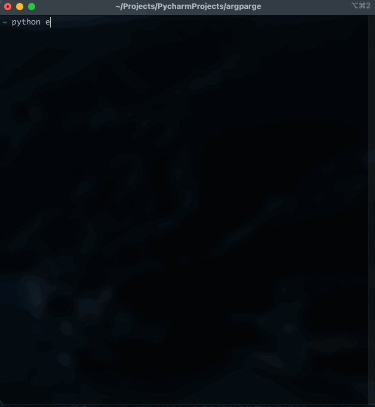

# Argparge

> A very simple tool to create beautiful console application by using native argparse.

| Project       | Commander                                    |
|---------------|----------------------------------------------|
| Author        | Özcan Yarımdünya                             |
| Documentation | https://ozcanyarimdunya.github.io/argparge/  |
| Source code   | https://github.com/ozcanyarimdunya/argparge/ |

`argparge` is a library that you can create beautiful class based cli application.

## Installation

Works on `python3+` with no extra dependencies.

```shell
pip install argparge
```

## Usage

**example.py**

```python
from argparge import Application
from argparge import Command


class GreetCommand(Command):
    name = "greet"
    help = "Greeting a person"

    def add_arguments(self, parser: "Command"):
        parser.add_argument("name", help="Person name")

    def handle(self, **arguments):
        print("Greeting, ", arguments.get("name"))


if __name__ == '__main__':
    app = Application(description="A simple argparge application")
    app.add_argument("-V", "--version", action="version", version="1.0.0")
    app.add_commands(
        GreetCommand(),
    )
    app.run()
```

If we run we get such output.



For more checkout [tutorials.](https://ozcanyarimdunya.github.io/argparge/tutorial/)

## LICENSE

```text
MIT License

Copyright (c) 2023 yarimdunya.com

Permission is hereby granted, free of charge, to any person obtaining a copy of this software and associated documentation files (the "Software"), to deal in the Software without restriction, including without limitation the rights to use, copy, modify, merge, publish, distribute, sublicense, and/or sell copies of the Software, and to permit persons to whom the Software is furnished to do so, subject to the following conditions:

The above copyright notice and this permission notice shall be included in all copies or substantial portions of the Software.

THE SOFTWARE IS PROVIDED "AS IS", WITHOUT WARRANTY OF ANY KIND, EXPRESS OR IMPLIED, INCLUDING BUT NOT LIMITED TO THE WARRANTIES OF MERCHANTABILITY, FITNESS FOR A PARTICULAR PURPOSE AND NONINFRINGEMENT. IN NO EVENT SHALL THE AUTHORS OR COPYRIGHT HOLDERS BE LIABLE FOR ANY CLAIM, DAMAGES OR OTHER LIABILITY, WHETHER IN AN ACTION OF CONTRACT, TORT OR OTHERWISE, ARISING FROM, OUT OF OR IN CONNECTION WITH THE SOFTWARE OR THE USE OR OTHER DEALINGS IN THE SOFTWARE.

```
