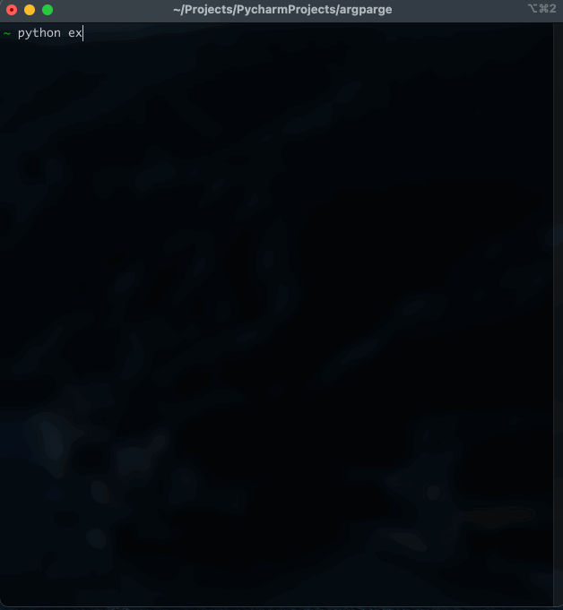

# Tutorial

## Simple usage (no subcommands)

```python
from argparge import Application

app = Application(description="A simple argparge application")
app.add_argument("message", help="Your message")
app.add_argument("-v", "--version", action="version", version="1.0.0")
app.run()
print(app.arguments)
```


## Multiple command usage

Let's have cli that user can `greet` a person, `list`, `create`, `sell` and item.

```python
from argparge import Application
from argparge import Command
from argparge import ParentCommand


class GreetCommand(Command):
    name = "greet"
    help = "Greeting a person"

    def add_arguments(self, parser: "Command"):
        parser.add_argument("name", help="Person name")

    def handle(self, **arguments):
        print("Greeting, ", arguments.get("name"))

class ItemListCommand(Command):
    name = "list"
    help = "List all item"

    def add_arguments(self, parser: "Command"):
        parser.add_argument("--limit", help="Limit the result (default: %(default)s)", default=10, type=int)

    def handle(self, **arguments):
        print("Listing", arguments.get('limit'), "items")


class ItemCreateCommand(Command):
    name = "create"
    help = "Create new item"

    def add_arguments(self, parser: "Command"):
        parser.add_argument("name", help="Item name")

    def handle(self, **arguments):
        print("Created item with name:", arguments.get("name"))


class ItemSellCommand(Command):
    name = "sell"
    help = "Sell an item"

    def add_arguments(self, parser: "Command"):
        parser.add_argument("name", help="Item name")
        parser.add_argument("-c", "--count", help="Item count", default=1, type=int)

    def handle(self, **arguments):
        name = arguments.get("name")
        count = arguments.get("count")
        print("Selling totally {} {} items".format(count, name))


if __name__ == "__main__":
    app = Application(description="A simple argparge application")
    app.add_argument("-v", "--version", action="version", version="1.0.0")
    app.add_commands(
        GreetCommand(),
        ParentCommand(
            ItemListCommand(),
            ItemCreateCommand(),
            ItemSellCommand(),
            name = "item",
            help = "Get list of items"
        )
    )
    app.run()
```

Now here is the results.

